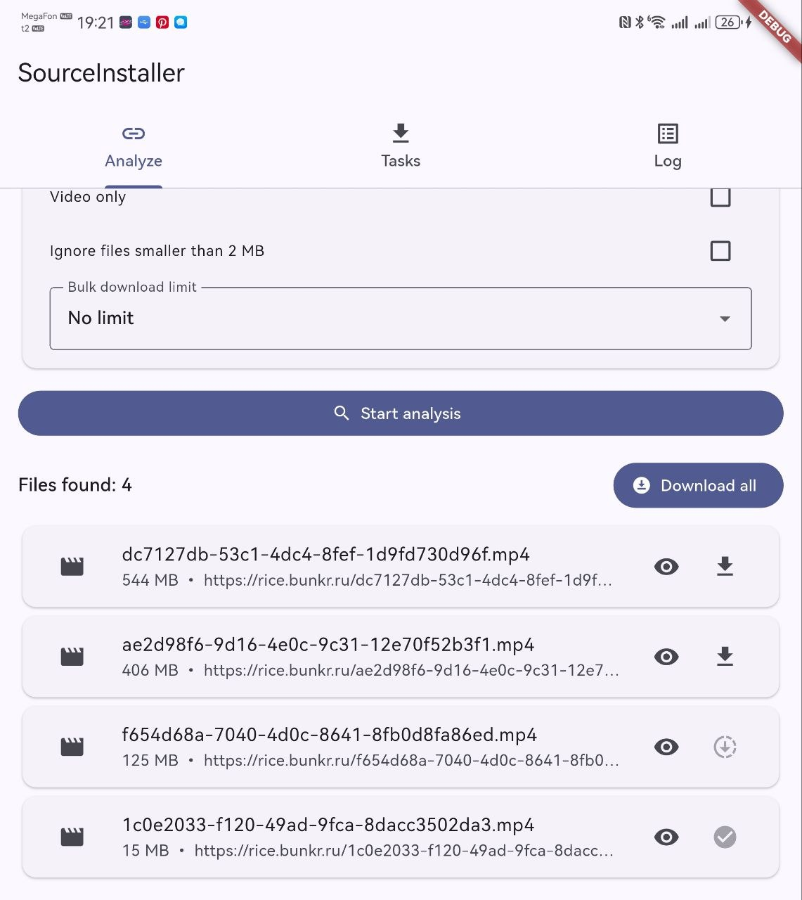
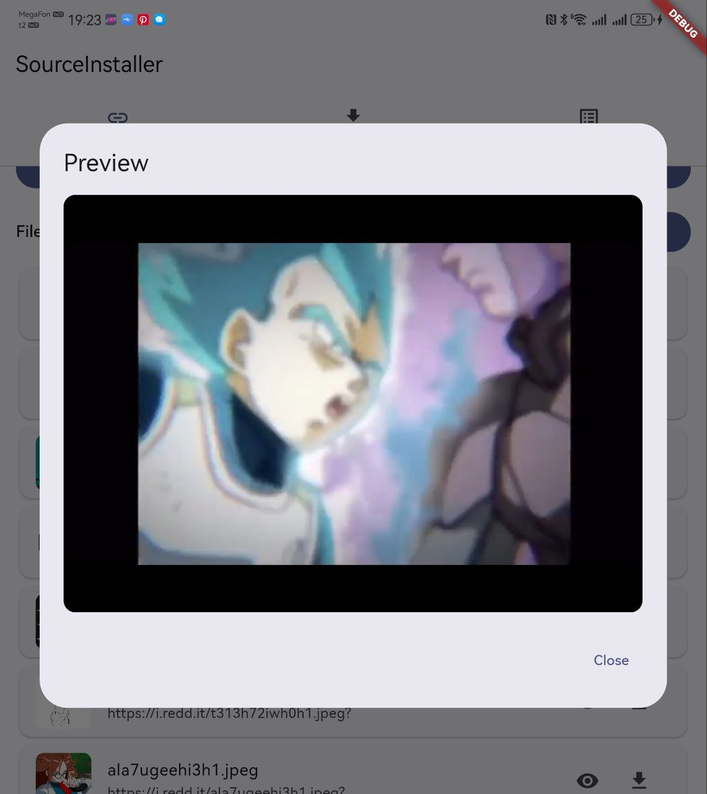
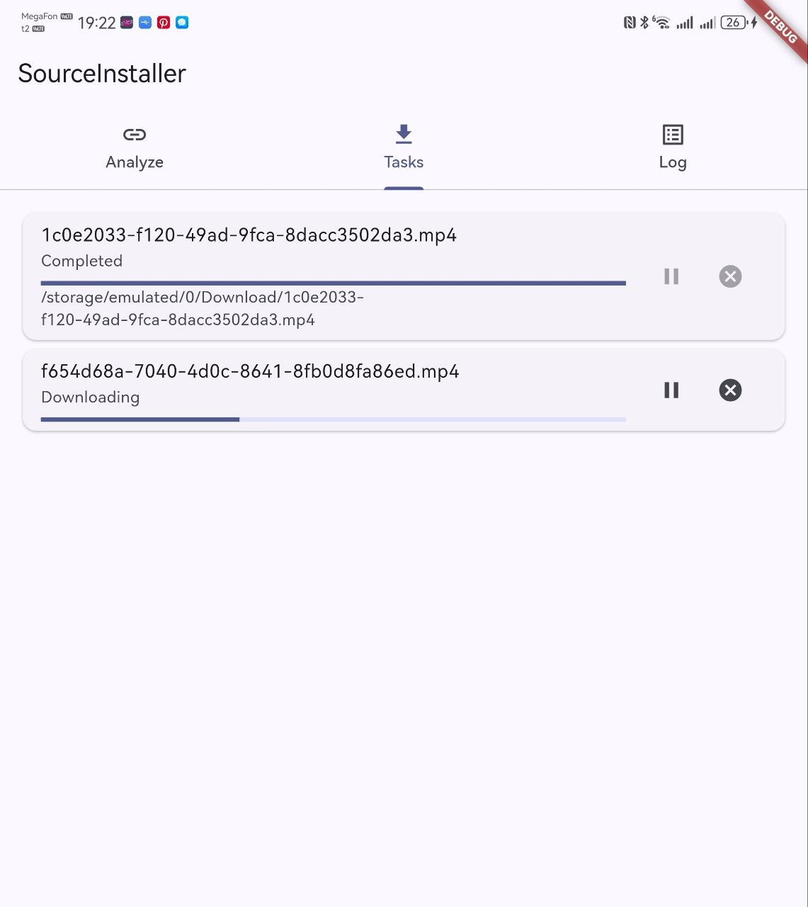

# SourceInstaller

The ultimate media installer for Reddit, Bunkr, Redgifs, and textboards/imageboards such as 2ch, 4chan, Lainchan, and Endchan.

SourceInstaller is a Flutter Android app for finding, previewing, filtering, queueing, and downloading media from supported web sources.

## Preview (`@preview/`)

| Analyze | Preview | Tasks |
|---|---|---|
|  |  |  |

<p align="center">
  
</p>

## Features

- Extract videos and media links from supported sources.
- Bunkr single-file and album support with refreshed video previews.
- Reddit post/media parsing.
- Redgifs dynamic WebView parsing.
- Static textboard/imageboard parsing for 2ch, 4chan/4channel, Lainchan, and Endchan.
- In-app media preview for videos and images.
- Bulk download queue with per-item progress, pause, cancel, and retry handling.
- Filters for video-only mode, minimum file size, and bulk download limits.
- Localized UI: English and Russian.
- CI/CD ready: GitHub Actions builds APK artifacts automatically.

## Supported sources

| Source | Status |
|---|---|
| Reddit | Posts and media URLs |
| Bunkr | Direct media, file pages, albums, refreshed previews |
| Redgifs | Dynamic WebView extraction |
| Textboards/imageboards | 2ch, 4chan/4channel, Lainchan, Endchan |

## Download APK

- Every push to `main`/`master` produces APK artifacts in GitHub Actions.
- Pushing a tag like `v1.0.0` creates a GitHub Release and attaches generated APK files.

## Local development

Prerequisites:

- Flutter stable SDK
- Java 17
- Android SDK

```bash
flutter pub get
flutter analyze
flutter test
flutter build apk --release --split-per-abi
```

Generated APKs are written to:

```text
build/app/outputs/flutter-apk/
```

## CI/CD

The workflow in `.github/workflows/android-apk.yml` runs:

1. `flutter pub get`
2. `flutter analyze`
3. `flutter test`
4. `flutter build apk --release --split-per-abi`
5. Upload APK artifacts
6. Create a GitHub Release for `v*` tags

### Optional release signing

Without signing secrets, CI falls back to the debug signing config so APK generation works for every fork. For production-style releases, add these GitHub repository secrets:

- `ANDROID_KEYSTORE_BASE64` — base64-encoded JKS/keystore
- `ANDROID_KEYSTORE_PASSWORD`
- `ANDROID_KEY_ALIAS`
- `ANDROID_KEY_PASSWORD`

Then push a release tag:

```bash
git tag v1.0.0
git push origin v1.0.0
```

## License

MIT. See [LICENSE](LICENSE).
